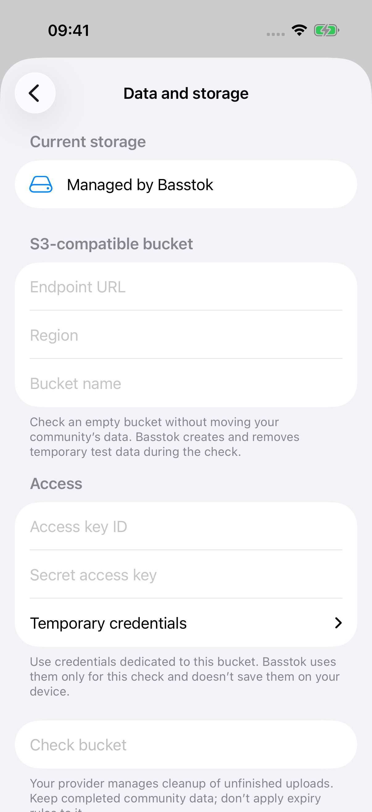

# Basstok storage

Your community's data should stay understandable and within reach.

Basstok keeps community records in readable JSON and media in ordinary
file formats. Community operators can arrange read/export access, inspect the
data with standard tools, and keep their own copies.

## Start with your data

Read a downloaded record with ordinary tools:

```sh
zstd -dc downloaded-record.json.zst | jq .
```

[Your data](docs/your-data.md) explains the formats and how to arrange access.
Use Basstok to make changes; editing stored objects directly is not supported.
Keep exports private, because they can include private community records.

## Use your own bucket

Check your bucket from Administration on iPhone, Android or the web. Nothing
moves until a Manager chooses **Move community**.



Basstok moves your existing community to the connected bucket. Activity pauses
during the move; you can leave the screen and return to check progress. If a
connection is interrupted, restore access and resume without starting over.

[Customer-managed S3](docs/customer-managed-s3.md) covers bucket requirements
and responsibilities. [Privacy and recovery](docs/privacy-and-recovery.md)
explains what ownership and exported copies do—and do not—provide.

[Explore Basstok](https://basstok.com/)
· [REST API](https://github.com/basstok/api) · [Agents](https://github.com/basstok/agents)
· [Contact](mailto:mail@basstok.com)
